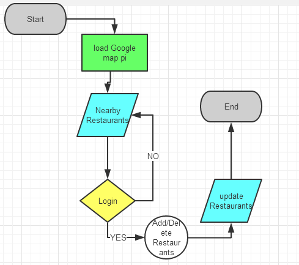

1.Wireframes

	if Guests, this app will support all nearby restaurants as table view and map view.
	if a member of User, no matter facebook user or normal user, app allows all displayed restaurant being management. such as: show all in map and table view, remove all from map and table view except user needed.
	User can share it to facebook or twitter if like. Such as:
	

2.API

3.Usecase

	in this part, there are five roles which include user, facebook sdk, twitter sdk, google api server, and amazon ec2. such as:
	
