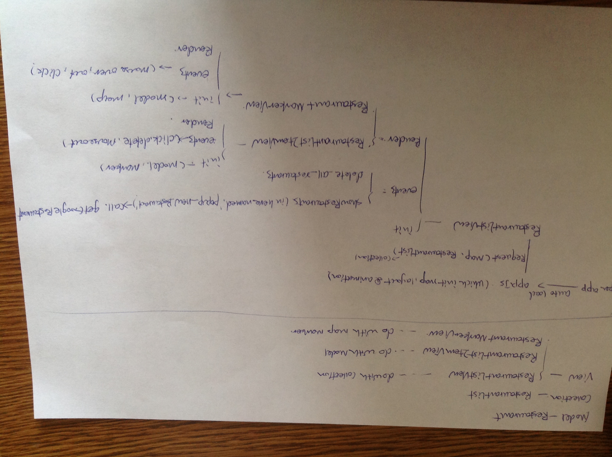

1. Wireframes 
	if Guests, this app will support all nearby restaurants as table view and map view.
	if a member of User, no matter facebook user or normal user, app allows all displayed restaurant being management. such as: show all in map and table view, remove all from map and table view except user needed.
	User can share it to facebook or twitter if like. Such as:
	

2.API 
	In server side, mongohq.com is this app's cloud database, the database name is 'assignment2', the name of collection is 'restaurant', db-server.js show more configure information and create, list, read one, and delete method are being created in db-rest-api.js and being tested through postman and this app. 
	however, the main of this app is to location user's current position and get nearby restaurants within 5000m from Google API, therefore, restaurants will be recorded into mongodb, and user could manage them. for example: delete or read. In this app, all of data are deny to update.

3.Usecase 
	in this part, there are five roles which include user, facebook sdk, twitter sdk, google api server, and amazon ec2. such as:
	

4.Architectural Diagrams 
  there are three main js files, which are app.js, assignment.js, faker.js 
  the main of app.js is to init this app including map and animation. next step is to call assignment.js, which purpose is not only to get and convert data into json fromat form google api using backbone.js, but also to communicate with mongodb through url, as for how to do with mongodb, you can see node/lib/db-server.js file 
  there are one model 'Restaurant', one Collection 'RestaurantList', three views 'listView', 'ListItemView','MarkerView', and one method named getGoogleRestaurant which is get data from GoogleAPI in assignment.js file. such as:
  