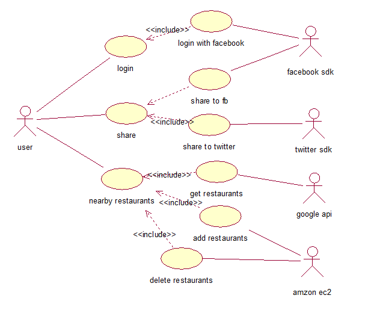

1. Wireframes 
	if Guests, this app will support all nearby restaurants as table view and map view.
	if a member of User, no matter facebook user or normal user, app allows all displayed restaurant being management. such as: show all in map and table view, remove all from map and table view except user needed.
	User can share it to facebook or twitter if like. Such as:
	

2.API
	In server side, mongohq.com is this app's cloud database, the database name is 'assignment2', the name of collection is 'restaurant', db-server.js show more configure information and create, list, read one, and delete method are being created in db-rest-api.js and being tested through postman and this app. 
	however, the main of this app is to location user's current position and get nearby restaurants within 5000m from Google API, therefore, restaurants will be recorded into mongodb, and user could manage them. for example: delete or read. In this app, all of data are deny to update.

3. Usecase 
	in this part, there are five roles which include user, facebook sdk, twitter sdk, google api server, and amazon ec2. such as:
	

4. Architectural Diagrams